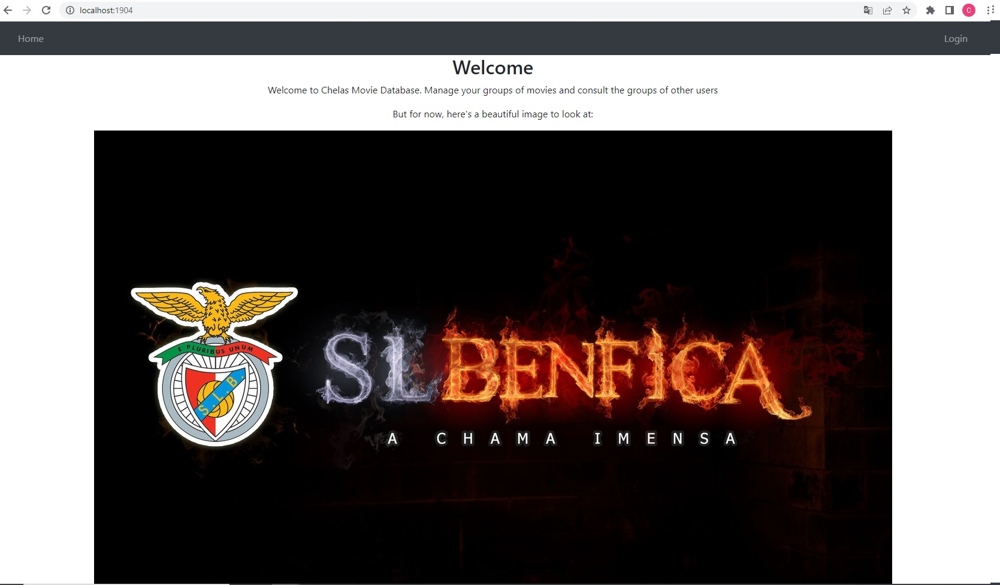
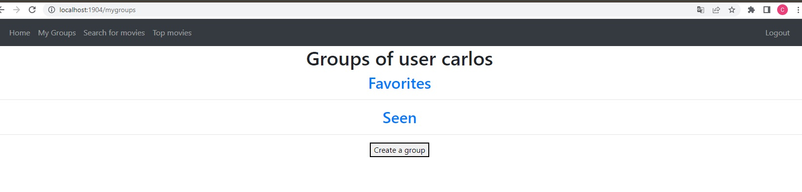
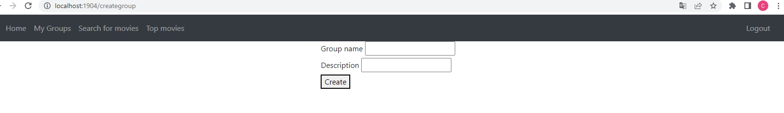
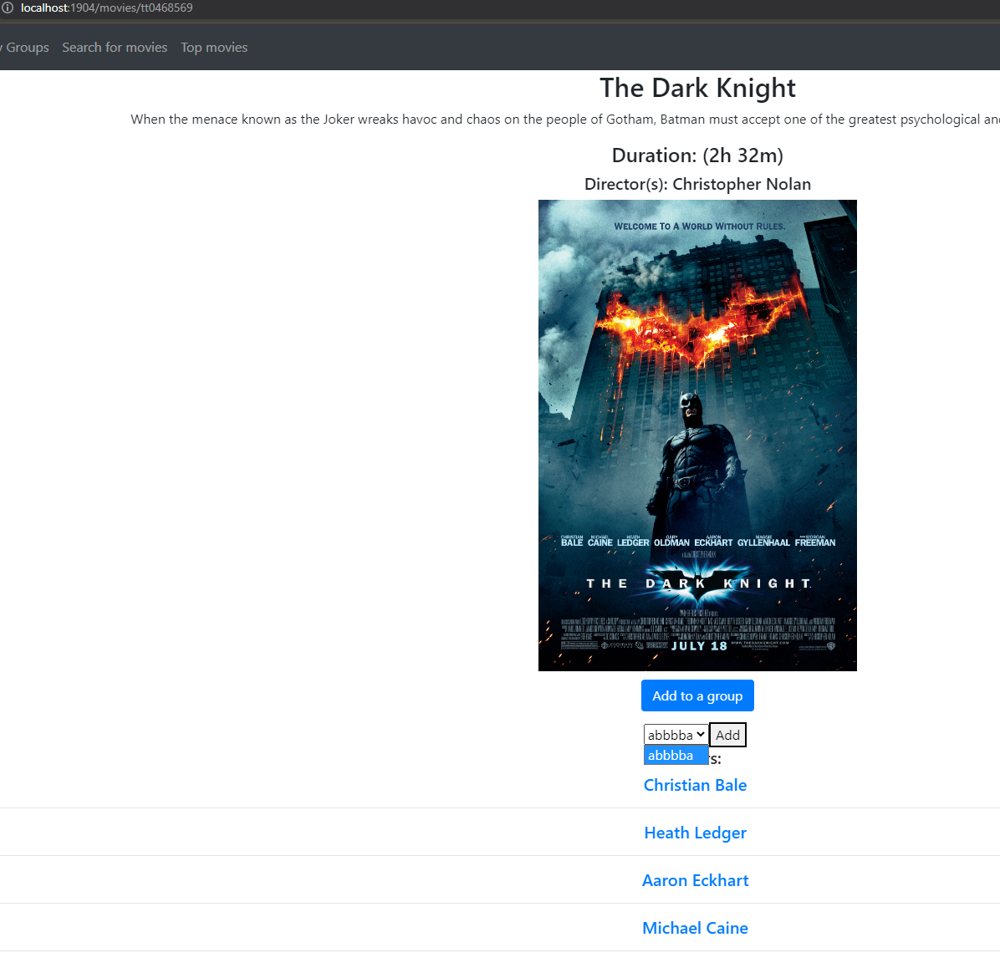

- You can use the [swagger open-api editor](https://editor.swagger.io/) to consult the [open-api](./cmdb-api-spec.yaml) documentation or use a VSC extensions to view the API documentation
- Use postman to open the [collection of tests](./cmdb-api-test.json)

# Code report / documentation

## How to run
- Make sure you're on `cmdb-ipw-leic2223i-ipw31n-g04\Code`
### In order to use, first install the dependencies in package.json 
- npm install

### Plain run:
- node cmdb-server.mjs
or
- npm run start

### Dev run (auto re-runs on code changes)
- npm run dev

### Run mocha tests
- npm run test

## Description of the application structure in server
The server is well structured, given the fact that we used JSdocs and classes, which also speeded up the development and reduced bugs during development.

The `cmdb-server.mjs` contains a function that allows the initialization of the server. 

We dont have repetitive hardcoded URI's, and we wrote many utility functions. 

We perform several request error checks, and return appropriate errors describing the problems.

A big perk of our application is that we cache the search results and top movies obtained from the IMDB API. And we store in our DB all movies and actors consulted. We do this in order to reduce API calls to IMDB to the minimum.

We also allow the flexibility between the data storage have it's origin from the Elastic Search DB or from the program's memory

## Description of the application structure in client
The client side application mostly uses HTML forms for GET, PUT, POST and DELETE requests. As requested for this phase, it was supposed to change from HTML forms to client-side fetches. And the only write-request we are performing client side without HTML forms is at the Login. 

Given the request of this phase, we decided that we would expect to write more client side javascript to obtain consulting the DOM to get input values before performing fetch requests, so we created a folder /scripts/ inside /web/site/ to split and organize Handlebars views from scripts. We also configured our solution in a way that avoids repetitive code. For example, we expected that the fetch() function would be called more repeatedly, so we wrote a fetx() function in /web/site/scripts/ which would be "imported" in HTML for places where we needed the fetx(), this would reduce repetitive code and simplify our HTTP requests to the API.

We could have performed better error validations on the client-side.

## Description of the mapping between the ElastictSearch’s Cmdb documents and the web application objects model.
For both elastic search and mem-data, the same objects definition were used, as defined in `Code/data/cmdb-data-objs.mjs`. The root object of each entity has an `id` and a wrapper object which contains the data itself of the object. This ensures compatability with elastic-search

# Entities / Objects
## **User**
- id: `string` 
### UserObj
- name: `string`
- groups: `Array<string>` (strings which are id's of groups)
- token: `string`
- hash: `string`
- salt: `string`
- api_key: `string`

## **Group**
- id: `string` 
### GroupObj
- name: `string` 
- description: `string` 
- isPrivate: `boolean`
- movies: `Array<GroupMovie>` (cached id, name and duration of a movie in the group (avoid's repetitive and demanding data calls))
- totalDuration: `number`

**Entities that use and get information from the IMDB API:**

The id is the same as the id used by the IMDB-API
## **Movie**
- id: `string`
### MovieObj
- name: `string`
- description: `string`
- imageURL: `string`
- duration: `number`
- directors: `string` 
- actorsList: `Array<MovieActor>` (cached id and name of actors, (avoid's repetitive and demanding data calls))

## **Actor**
- id: `string`
#### ActorObj
- image: `string` *(a link)*
- name: `string` 
- birthDate: `string` *(In international format YYYY-mm-dd)*

## Some images of the website

